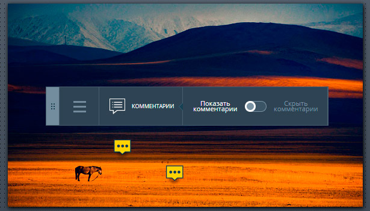
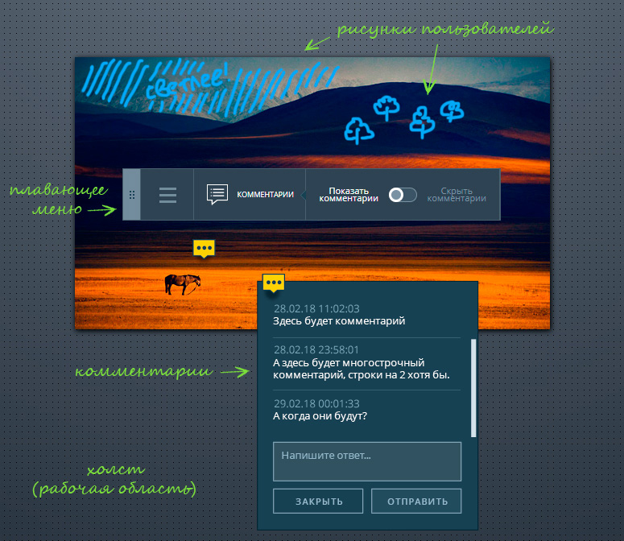
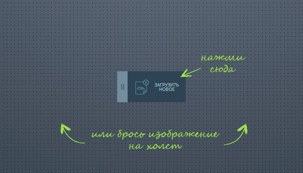
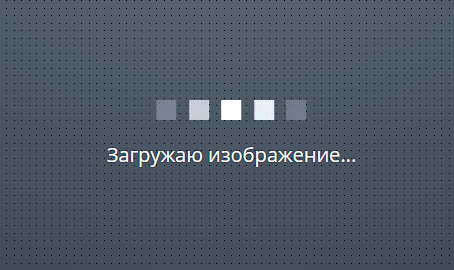
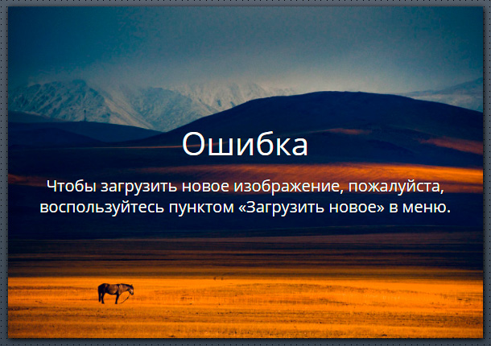
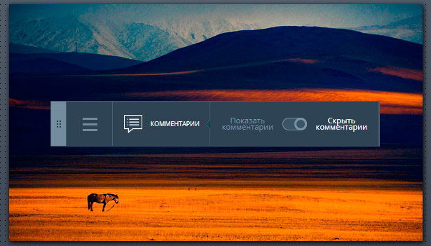

Дипломный проект курса «JavaScript в браузере» (копия приватного репозитория https://github.com/netology-code/hj-23-rodionov217)
===

В рамках дипломного проекта была реализована клиентская часть сервиса, позволяющего рецензировать изображения.

Сервис предоставляет пользователям следующие возможности:
- загружать изображения, перетянув файл в окно браузера или через диалоговое окно;
- добавлять комментарии к конкретной части изображения;
- рисовать поверх изображения.

А также сервис наделен элементами совместной работы:
- загруженное изображение имеет уникальную ссылку, которой можно поделиться;
- все пользователи, просматривающие изображение, уведомляются о новых комментариях к нему;
- все пользователи, просматривающие изображение в режиме рисования, видят, что рисуют другие пользователи.

## Интерфейс

Приложение имет два состояния:

1. Публикация (_состояние по умолчанию_):


2. Рецензирование:



Приложение имеет четыре компонента:
- _Холст_, основная рабочая область, в которой располагаются рецензируемое изображение и плавающее меню;
- _Плавающее меню_, позволяющее переключаться между режимами и инструментами;
- _Маска со штрихами пользователей_, созданными в режиме **Рисование**;
- _Комментарии пользователей_, оставленные в режиме **Комментирование**.

Компоненты обозначены на рисунке ниже:



### Публикация

Этот режим открывается по умолчанию при открытии интерфейса: 



В нём доступна всего одна функция: выбор изображения и его публикация на сервере. Изображение можно выбрать двумя способами:

1. Кликнуть на поле «Загрузить новое», после чего откроется стандартный диалог выбора файла. Выбор ограничен только JPG и PNG изображениями.
2. Перетащить файл изображения и бросить на холст. 

В обоих случаях, сразу после успешного выбора изображения, оно публикуется на сервере. 

Пока изображение загружается на сервер, отображается прелоадер:



В случае успеха интерфейс переходит в состояние **Рецензирование**, режим «Поделиться».

При этом, если открыть приложение заново (не по ссылке из «Поделиться») в том же окне, должен отображаться чистый холст.


#### Ошибки при публикации

Если на холст брошена не картинка, либо картинка в другом формате (не JPG и PNG), появится сообщение об ошибке:


При этом, у пользователя остаётся возможность попробовать загрузить выбранное изображение повторно, либо выбрать другое изображение.

После успешной загрузки и отображения изображения на холсте, последующие изображения, брошенные на холст или на имеющееся изображение, будут проигнорированы, а пользователю будет показано сообщение с рекомендацией воспользоваться опцией «Загрузить новое» в меню:



### Рецензирование

В состояние **Рецензирование** интерфейс переходит после успешной загрузки изображения:


В это состояние возможно попасть двумя способами:
1. После успешной публикации изображения открывается режим «Поделиться» (_описано в состоянии «Публикация»_).
2. При переходе по ссылке скопированной из режима «Поделиться» открывается режимы «Комментирование» (_будет описан ниже_).

В данном состоянии **Рецензирования** доступно три режима: комментирование, рисование, поделиться. 

#### Режим «Комментирование»

Режим открывается при переходе по ссылке полученной в режиме «Поделиться». А так же при клике на пункт «Комментарии» в меню. В этом режиме можно добавлять новые комментарии на любое место на изображении.

Доступен переключатель, позволяющий показать или скрывать маркеры комментариев.


По умолчанию, маркеры отображаются. При появлении нового комментария, добавленного другим пользователем, его маркер отображается на холсте. При клике на каждый маркер открывается окно с комментарием или цепочкой комментариев и формой для отправки нового комментария:


Если в меню выбрать «Скрыть комментарии», то маркеров комментариев не видно:



Это может потребоваться, например, чтобы маркеры не мешали рисовать (_режим «Рисование»_). Маркеры комментариев можно вернуть только выбрав в меню «Показать комментарии».

При клике в любую точку на холсте, открывается форма добавления нового комментария.

#### Режим «Рисование»


Здесь доступна возможность выбора цвета пера из пяти доступных: 
- красный, 
- жёлтый, 
- зелёный, 
- синий 
- и фиолетовый.


#### Режим «Поделиться»


Открывается сразу после публикации. Тут доступна ссылка, перейдя по которой приложение откроется и сразу перейдет в состояние «Рецензироние» именно с этим изображением.

#### Переключение между режимами

Для переключения между режимами пользователю доступно плавающее меню. Меню можно переместить в любую часть холста, если зажать кнопку мыши на «корешке». Перемещённое меню сохраняет своё положение при обновлении страницы.

Раскрыть меню и выбрать другие режимы можно, кликнув на поле «бургер-меню». Переключение осуществляется следующим образом:


При переключении режимов также есть возможность вернуться в состояние **Публикация**.

Меню всегда должно отражать текущее состояние и режим приложения. Если мы в состоянии **Публикация**, то поле «бургер-меню» не отображается, так как доступен только один пункт. Если мы в состоянии **Рецензирование**, то выбран один из режимов, остальные скрыты в поле «бургер-меню».

## Взаимодействие с сервером по HTTP

Для взаимодействии с серверной частью приложения используется REST API по адресу:

https://neto-api.herokuapp.com

### Добавление изображения

`POST /pic` — позволяет опубликовать на сервере новое изображение.

Формат данных при отправке `multipart/form-data`. Поля:

- `title` — название изображения, _строка_
- `image` - изображение, _файл_

В ответ приходит либо сообщение об ошибке, либо JSON-объект с данными о изображении. Например:
```json
{
  "id": "aba23fc0-1008-11e8-b8b2-2b0fbff0de7d",
  "title": "Макет дизайна",
  "url": "https://storage.googleapis.com/neto-api.appspot.com/pic/aba23fc0-1008-11e8-b8b2-2b0fbff0de7d/bMFAlDwf9AI.jpg",
  "timestamp": 1518449006013
}
```


### Получение информации об изображении

`GET /pic/${id}` — получить информацию об изображении в JSON-формате. Тут `${id}` — идентификатор изображения на сервере.

В ответ приходит либо сообщение об ошибке, либо JSON-объект с данными об изображении. Например:
```json
{
  "id": "aba23fc0-1008-11e8-b8b2-2b0fbff0de7d",
  "title": "Макет дизайна",
  "url": "https://storage.googleapis.com/neto-api.appspot.com/pic/aba23fc0-1008-11e8-b8b2-2b0fbff0de7d/bMFAlDwf9AI.jpg",
  "mask": "https://www.googleapis.com/download/storage/v1/b/neto-api.appspot.com/o/pic%2F8ece7a20-15f4-11e8-96fd-2513ea9afcae-mask.png?generation=1519100719825524&alt=media",
  "timestamp": 1518449006013,
  "comments": {
    "-L59YakIzQIO4_qiP6ws": {
      "left": 100,
      "message": "Тут мне кажется лучше подойдет розовый цвет",
      "timestamp": 1518448045157,
      "top": 65
    },
    "-L59bM_rv4fesvnQ1nts": {
      "left": 953,
      "message": "Эта картинка на коллаже слишком шумная",
      "timestamp": 1518449031562,
      "top": 480
    }
  },
}
```


### Добавление комментария к изображению

`POST /pic/${id}/comments` — позволяет добавить комментарий к изображению с идентификатором `${id}` на сервере.

Формат данных при отправке `application/x-www-form-urlencoded`. Поля:
- `message` — текст комментария, _строка_.
- `left` — расстояние по горизонтальной оси X от левого края изображения, _число_;
- `top` — расстояние по вертикальной оси Y от верхнего края изображения, _число_.

В ответ приходит либо сообщение об ошибке, либо JSON-объект с обновленными данными об изображении (см. _Получение информации об изображении_).

## Взаимодействие с сервером через веб-сокет

Для обновления интерфейса в «реальном» времени дополнительно реализован веб-сокет сервер, принимающий запросы на соединение по адресу:

wss://neto-api.herokuapp.com/pic/${id}

Тут `${id}` это идентификатор изображения. Таким образом, по соединению передаётся только информация, связанная с этим изображением.

Сервер передаёт информацию о возникших событиях (сомментарий или рисунок) в формате JSON.


## Реализация

**При создании сервиса не использовались сторонние библиотеки. В том числе jQuery, underscore и другие.**